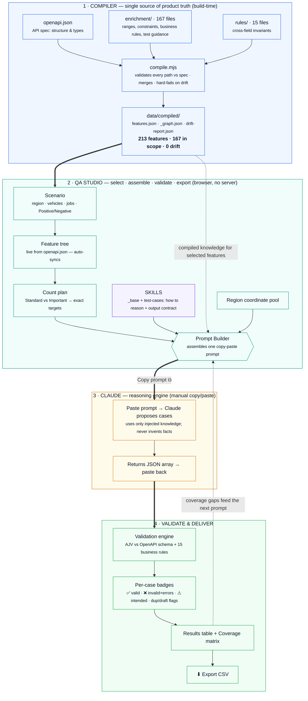
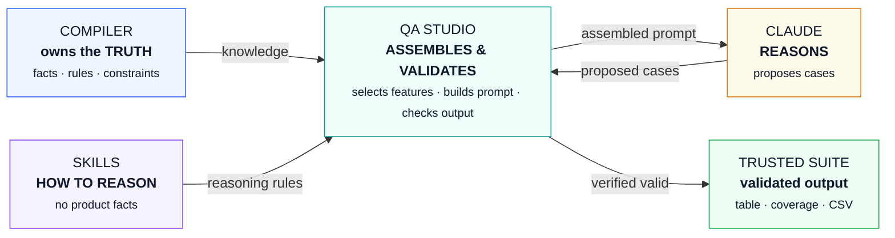

# QA Authoring Studio — Diagrams (Mermaid)

Two ready-to-render diagrams. Paste either block into **[mermaid.live](https://mermaid.live)**,
GitHub/GitLab markdown, Notion, or any Mermaid-capable slide tool. `mermaid.live` also exports
**PNG/SVG** for slides.

> A polished, screenshot-ready version is also in **`ARCHITECTURE_DIAGRAM.html`** (open in any browser).

---

## Diagram 1 — End-to-end flow (main slide)

---

## Diagram 2 — Responsibilities (one-glance "who owns what")

Use this when you want to make the *single-source-of-truth* point in a single slide.

---

### The one line to say over either diagram
> "The spec is the single source of truth, Claude does the reasoning, and the tool proves every result before we trust it."
